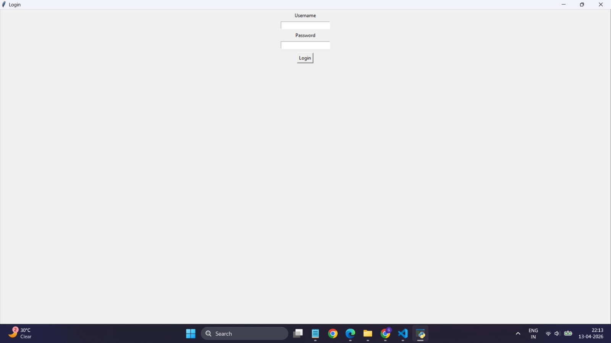
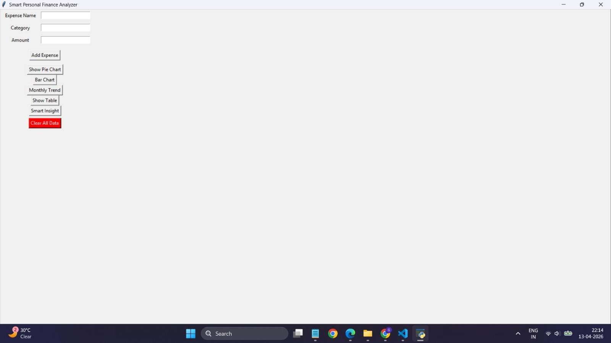
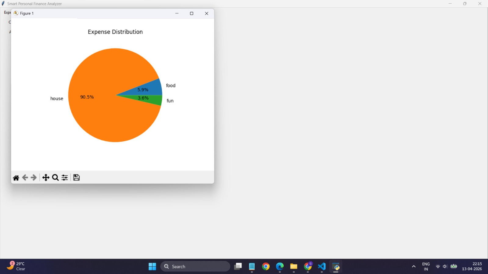
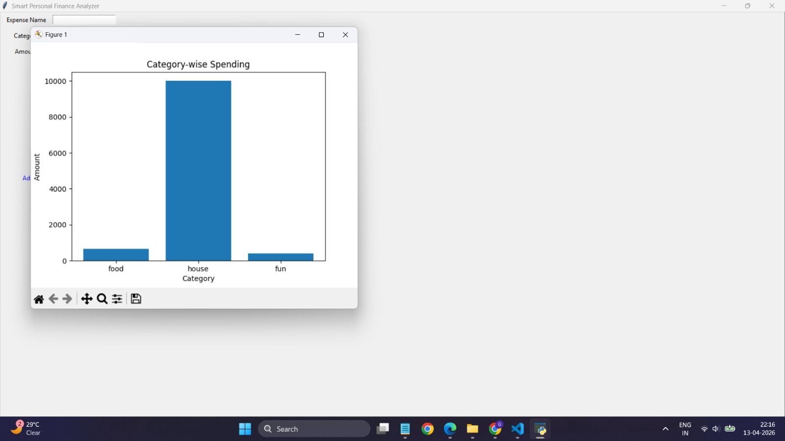
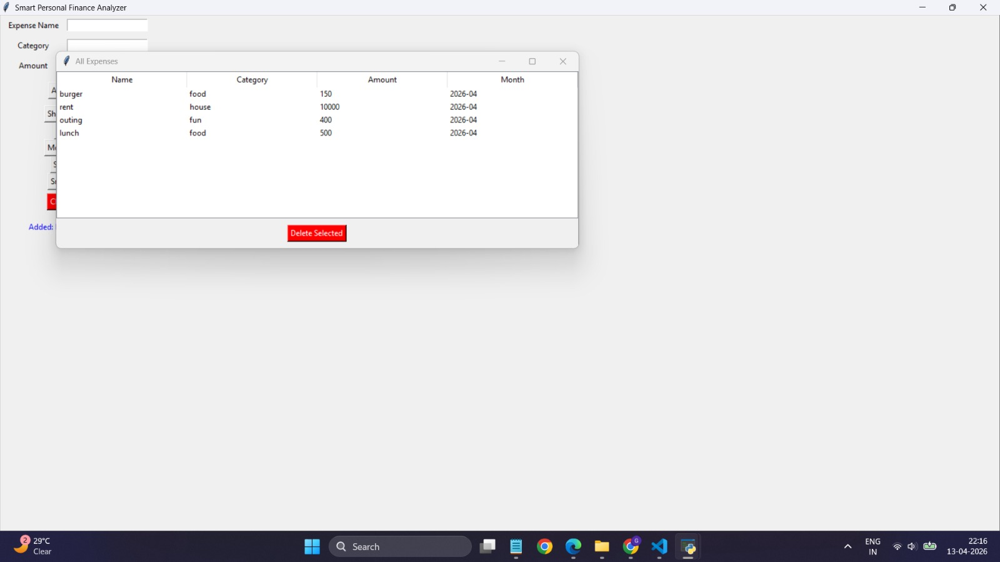

# 💰 Smart Personal Finance Analyzer

A Python-based GUI dashboard application to track, manage, and analyze personal expenses.

## 🚀 Features
- 🔐 Login Authentication
- ➕ Add & Manage Expenses
- 🗑️ Delete & Clear Data
- 📊 Data Visualization (Pie Chart, Bar Graph, Trends)
- 📋 Dashboard View with Summary
- 🧠 Smart Spending Insights

## 🛠️ Tech Stack
- Python
- Tkinter
- Matplotlib
- CSV (Data Storage)

## 🔐 Login Credentials
Username: swasti  
Password: 1308  

## 📸 Screenshots

### 🔐 Login Screen

### 🧾 Dashboard

### 📊 Pie Chart

### 📊 Bar Chart

### 📋 Table View

## 📌 Future Enhancements
- SQLite Database Integration
- AI-based Spending Suggestions
- Multi-user System

---

## 💡 About
This project demonstrates GUI development, data visualization, and basic authentication using Python.
